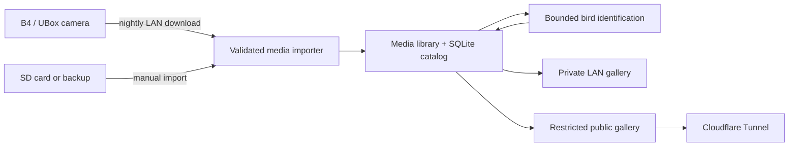

# Backyard Birds

A self-hosted bird-feeder camera gallery for Raspberry Pi. Backyard Birds
imports recordings from a B4/UBox camera, identifies visitors with OpenAI,
and turns the results into a fast, mobile-friendly wildlife archive.

**Live gallery:** [backyard-birds.ca](https://backyard-birds.ca)


The project grew out of an interoperability investigation into an owned B4
camera. It now runs independently of the UBox app for nightly SD-card media
retrieval, while keeping the camera and gallery data on the local network.

## Highlights

- Imports the camera's paired JPEG and MP4 files without renaming or deleting
  the originals.
- Downloads recent SD-card events directly over the LAN with bounded retries,
  chunk validation, and atomic writes.
- Builds a responsive archive with date, species, wildlife, bird-count, and
  star filters.
- Identifies birds and other feeder visitors using structured OpenAI Responses
  API output, with local request and budget limits.
- Supports global star counts, iOS-friendly video sharing, and a separate
  read-only public-gallery mode.
- Keeps the administration gallery private behind nginx authentication while a
  Cloudflare Tunnel exposes only the restricted public process.
- Includes systemd services for downloading, classifying, backing up, and
  serving the gallery unattended on a Raspberry Pi.
- Uses only the Python standard library for the core application.


## How it works



The importer is the boundary between camera media and the application. It
normalizes the observed card layout, pairs snapshots with recordings, and is
safe to run repeatedly. Classification metadata and stars live in SQLite; the
canonical camera files stay unchanged.

## Requirements

- Python 3.10 or newer
- macOS or Linux for local use; 64-bit Raspberry Pi OS for the deployed setup
- `ffmpeg` only when preparing broadly compatible mobile-share videos
- An OpenAI API key only when bird identification is explicitly enabled

The gallery, importer, analysis tools, and tests have no third-party Python
dependencies.

## Quick start

Clone the repository and run the tests:

```bash
git clone https://github.com/jamiewaese/bird-feeder.git
cd bird-feeder
python3 -m unittest discover -v
```

Import a camera card or an existing backup. A dry run is a good first step:

```bash
python3 -m python_tools.import_media \
  --source /path/to/card-or-backup \
  --library ./library \
  --camera-id yard \
  --dry-run

python3 -m python_tools.import_media \
  --source /path/to/card-or-backup \
  --library ./library \
  --camera-id yard
```

Start the local gallery:

```bash
python3 -m web.app \
  --library ./library \
  --host 127.0.0.1 \
  --port 8080
```

Then open [http://127.0.0.1:8080](http://127.0.0.1:8080).

The importer accepts both the camera's canonical `video/` directory and the
`videos/` alias used by some backups. Re-running it is idempotent.

## Bird identification

Classification is opt-in. Without `--execute`, the command previews the next
batch without making API requests or changing the catalog:

```bash
python3 -m python_tools.classify_birds \
  --library ./library \
  --max-images 5
```

To classify a bounded batch:

```bash
export OPENAI_API_KEY='your-project-api-key'

python3 -m python_tools.classify_birds \
  --library ./library \
  --execute \
  --max-images 5 \
  --monthly-image-limit 100 \
  --monthly-budget-usd 10.00 \
  --paired-only
```

Results include the common and scientific names, certainty, bird count,
behavior, field marks, sex and age when visually supportable, and a concise
species fact. Non-bird animals and empty frames are recorded separately.

The classifier is deliberately conservative: it requires `--execute`, keeps a
local monthly usage ledger, processes one request at a time, does not retry API
requests automatically, and sends requests with OpenAI response storage
disabled. The local dollar ledger is an estimate, not a substitute for an API
project budget.

## Camera discovery and network download

The reconnaissance tools are limited to private, link-local, and loopback IPv4
space. Start by inspecting the local network:

```bash
python3 -m python_tools.recon local --human
python3 -m python_tools.recon neighbors --human
```

For the controlled discovery procedure, see
[`docs/phase-1-reconnaissance.md`](docs/phase-1-reconnaissance.md).

The nightly downloader uses the vendor's Android ARM64 transport library for
session establishment, plus the small compatibility bridge in
`camera/ubox_native/`. The proprietary `libUBICAPIs.so` is not distributed in
this repository. With that library supplied from an owned device/app and the
native client built, recent media can be retrieved and imported with:

```bash
make -C camera/ubox_native
export UBOX_UID='your-camera-uid'
export UBOX_PASSWORD='your-camera-password'

python3 -m python_tools.download_ubox \
  --library ./library \
  --native-dir /path/to/native-runtime \
  --camera-id yard \
  --lookback-hours 36
```

Use these tools only on devices and networks you own or are authorized to
test. Full protocol and reliability notes are in
[`docs/phase-3h-network-sd-downloader-2026-08-10.md`](docs/phase-3h-network-sd-downloader-2026-08-10.md).

## Deployment

The `deploy/` directory contains the production building blocks used on the Pi:

- hardened systemd services and timers for the LAN gallery, public gallery,
  downloader, classifier, and backup job;
- an nginx configuration for authenticated LAN access;
- host firewall and SSH-hardening rules;
- a Cloudflare Tunnel configuration example; and
- environment-file examples containing placeholders only.

The public gallery runs as a separate least-privileged process. It omits delete
controls and the private media/health APIs, restricts mutations to
same-origin CSRF-protected stars, binds to loopback, and is intended to sit
behind a tunnel with no router port forwarding.

See [`docs/public-gallery-deployment-2026-08-10.md`](docs/public-gallery-deployment-2026-08-10.md)
and [`docs/security-hardening-2026-08-09.md`](docs/security-hardening-2026-08-09.md)
before adapting the supplied service files. They contain installation-specific
paths and addresses that should be reviewed for your environment.

## Repository layout

```text
camera/
  analysis/          Safe pcapng and UDP structure parsers
  classification/    Catalog schema and OpenAI classifier
  discovery/         Bounded LAN discovery and protocol probes
  sdcard/            Card-layout validation and idempotent import
  ubox_native/       Native event/file client and ABI bridge
deploy/              Pi services, nginx, firewall, SSH, TLS, and tunnel config
docs/                Investigation notes, protocol evidence, and runbooks
python_tools/        Command-line entry points
tests/               Offline and loopback-only unit tests
web/                 Dependency-free gallery and media server
```

## Safety and privacy

- Captures, backups, imported libraries, environment files, and generated
  native binaries are excluded from Git.
- Published documentation and deployment examples use generic IP addresses,
  hostnames, account names, network labels, and locally administered MAC
  addresses; they are not values from the running installation.
- Camera and OpenAI credentials are read from environment variables; real
  secret files should remain outside this repository with restrictive
  permissions.
- The protocol tests use temporary loopback sockets and never contact the
  camera or another LAN device.
- Deleting a gallery item permanently removes its paired snapshot and video.
  Maintain a tested external backup before enabling administration features.

## Documentation

The [`docs/`](docs/) directory preserves the evidence and decisions behind the
implementation, from initial device discovery and packet analysis through SD
retrieval, gallery UX, public deployment, and host hardening. It is useful if
you are adapting the project to similar hardware or want to understand the
protocol work rather than only run the gallery.
